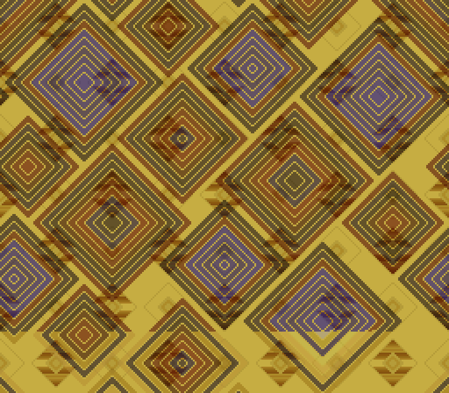
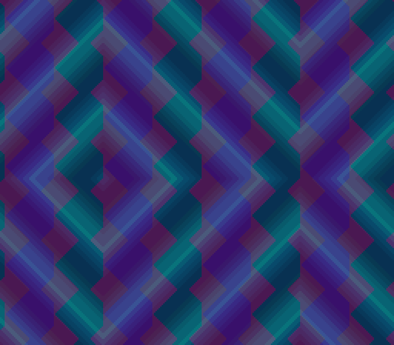
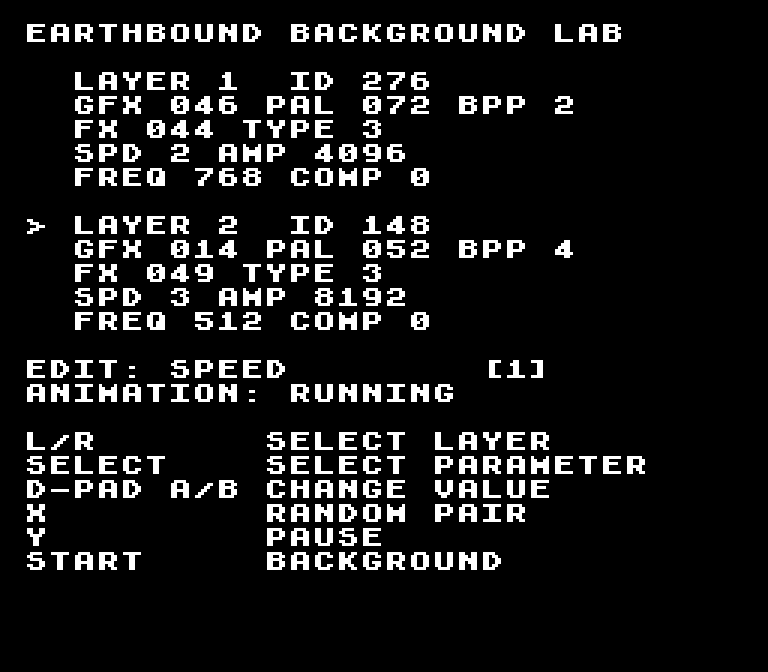

# EarthBound Background Lab for SNES

A controller-driven SNES ROM for exploring EarthBound battle-background layers. It carries the complete 327-layer catalog and native tile, arrangement, palette, and effect data in a 1 MiB LoROM image.

The current renderer uses the SNES PPU directly: two Mode 1 backgrounds, native color math for the blend, palette cycling, and lightweight motion derived from each layer's effect parameters. It does not yet reproduce EarthBound's scanline distortion exactly; that needs an HDMA pass.

## Controls

- L / R: select layer 1 or layer 2
- D-pad or A / B: raise or lower the selected value; Up and Down move by 10
- X: choose a random pair
- Y: pause or resume animation
- Start: open or close the debug screen
- Select: choose the field edited in the debug screen

The debug screen reports each layer ID, graphics bank, palette, effect, effect type, speed, amplitude, and frequency. Speed, amplitude, frequency, and compression can be adjusted independently for either layer.

## Build

The project is pinned to [PVSnesLib 4.6.0](https://github.com/alekmaul/pvsneslib/releases/tag/4.6.0).

```sh
export PVSNESLIB_HOME=/path/to/pvsneslib
make generate
make test
make
```

The ROM is written to `earthbound_background_lab.sfc`.

`make generate` rebuilds the SNES assets and C tables from the two JSON files in `data/`. Two-bit graphics banks are expanded to four-bit planar tiles so both backgrounds can share Mode 1.

## Verification

Host tests cover controller state, wraparound, random selection, and asset conversion. The ROM is also built in GitHub Actions. For a local emulator smoke test:

```sh
/path/to/Mesen --testrunner --timeout=10 \
  tests/mesen-smoke.lua earthbound_background_lab.sfc
```

This boots the ROM, exercises Start, Select, R, and A, and checks that Mesen produces a non-uniform PNG frame after 150 frames.

Real-hardware behavior has not yet been checked on a SNES or flash cartridge.

## Examples

The [eight-second emulator capture](examples/earthbound-background-lab-demo.mp4) changes the pair, opens the debug screen, selects layer 2, raises its speed, returns to the background, and changes the pair again.







## Provenance

See [THIRD_PARTY_NOTICES.md](THIRD_PARTY_NOTICES.md) for the extracted background-data source and license record. Game names and original game assets belong to their respective owners; this is an independent technical project.
